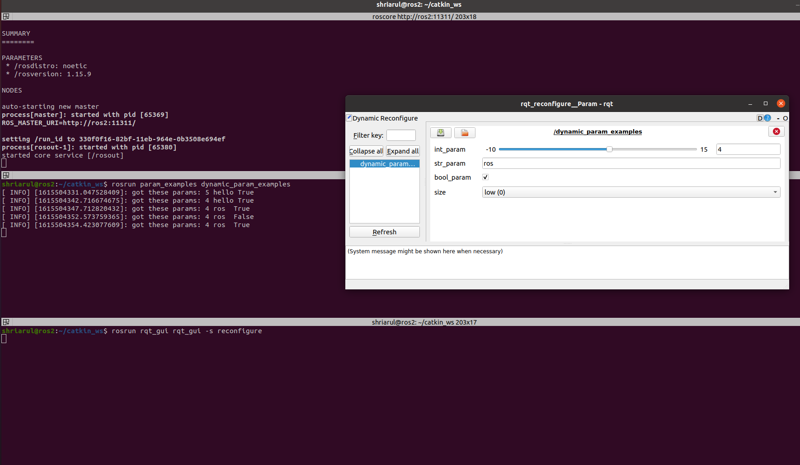

# params_example

## This package contains:
Some examples for accessing (setting,modifying)the ROS Parameter server from c++,python and launch files scripts.And accessing (setting,modifying) with a rqt_gui.

## setting parameters from non-GUI :

- A C++ script to set a parameter
- A Python script to set a parameter
- A launch file to load a set of parameters.
* setting parameters with a GUI:
    - A C++ and python script to set,change multiple parameter from rqt_gui.**rosrun param_examples dynamic_param_examples** to run the script and run the **rosrun rqt_gui rqt_gui -s reconfigure** to get the GUI,the figure below is an example of. 

The launch file to launch **roslaunch param_examples param_example.launch** for a simple parameter load up from a yaml file.

The launch file to launch a GUI accessing is **roslaunch param_examples dynamic_param_py.launch**.
